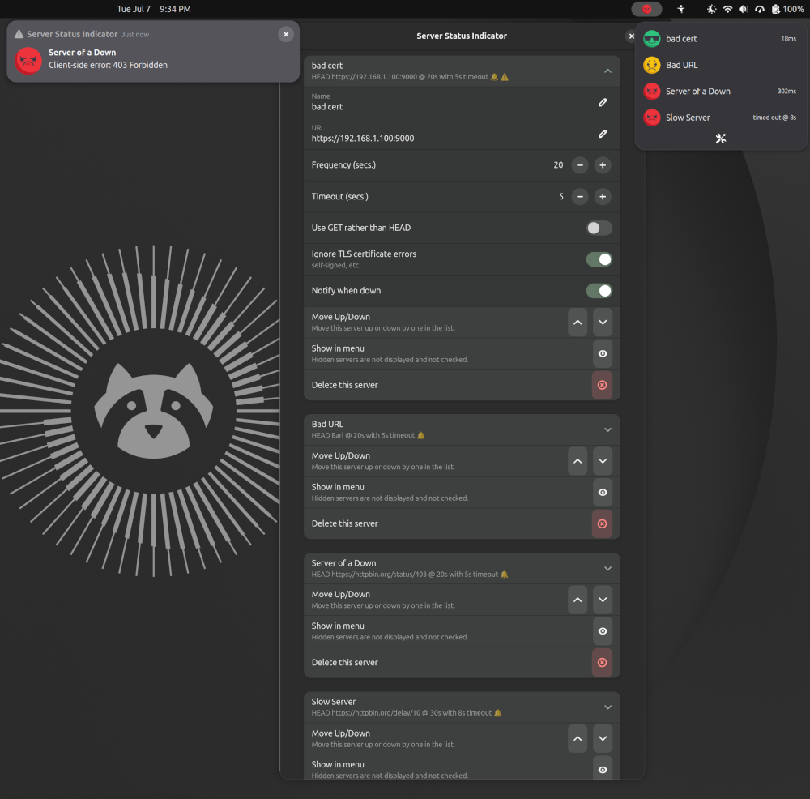
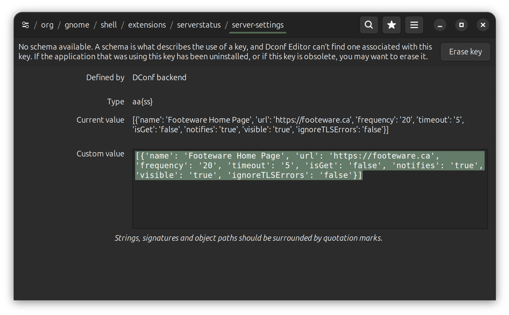

# serverstatus@footeware.ca

A GNOME Shell extension with an indicator in the panel displaying status of entered web server URLs using emojis:

 initializing...

 server down/unresponsive/timed out

 malformed URL

 server up and responding

---

The panel icon shows the worst status from the set of all server statuses in the popup menu. Server down is considered worse than bad URL.

There's a configurable timeout on the requests (10 second default) and HTTP response codes 2xx and 3xx are treated as success.

There's a per server option to show a notification when it's down. It defaults to false but can easily be switched on.

There's another per server option to ignore TLS errors. Useful if using a self-signed certificate or for accessing a server whose certificate subject is a domain name but using its IP. Thanks to [FilipLaurentiu](https://github.com/FilipLaurentiu) for that enhancement request.

Servers can be made visible (default) or hidden, where the server is not displayed in the menu and no requests are made to it. Many thanks to [xingwangzhe](https://github.com/xingwangzhe) for that enhancement.

Install at [extensions.gnome.org](https://extensions.gnome.org/extension/4687/server-status-indicator/) or use [Extension Manager](https://flathub.org/en/apps/com.mattjakeman.ExtensionManager).

To customize, the four **.svg** files in the **assets** folder can be swapped out with your own icons. Just keep the same filenames.

---

## Backups

Always a good idea. I thought about adding a backup/restore function but I realized [DConf Editor](https://apps.gnome.org/DconfEditor/) already works well. Just copy the JSON text to a backup file and paste to restore from the file.

---
