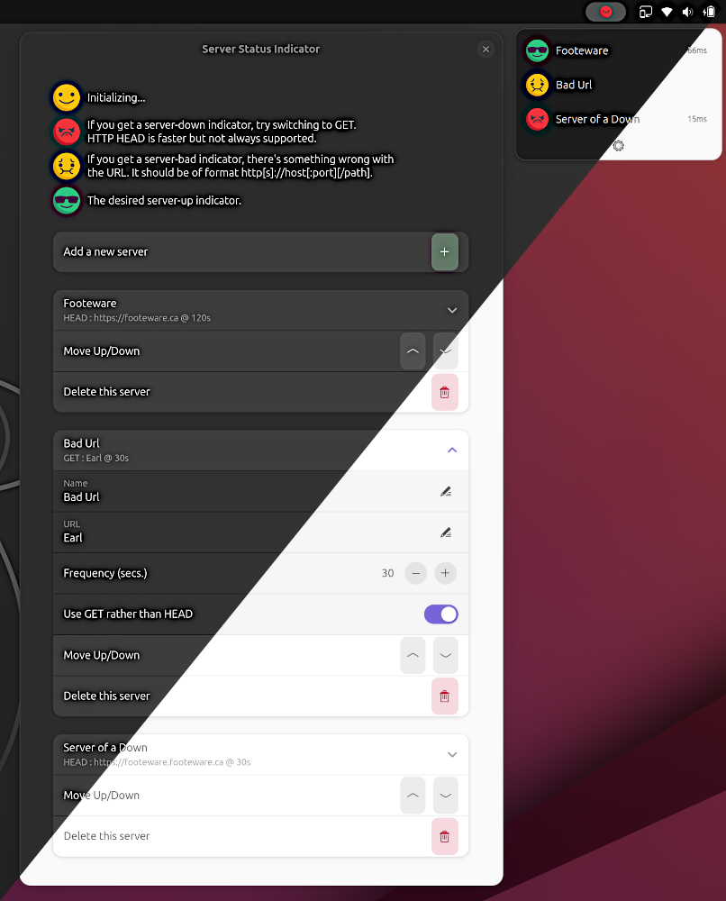

# serverstatus@footeware.ca

A GNOME Shell extension with an indicator in the task bar displaying status of entered web server URLs using emojis: 

 initializing...

 server down/unresponsive 

 malformed URL

 server up and responding

The task bar shows the worst status from the set of all server statuses in the popup menu. Server down is considered worse than bad URL.

